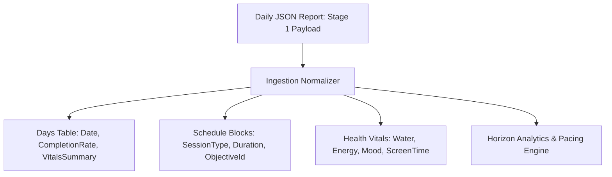

# Feature Specification: Data Storage & Report Ingestion (Stage 2)

## 1. Overview and Context
In Stage 1, daily plans and health vitals are kept in local cache storage and exported as JSON reports. **Stage 2** introduces a structured, persistent storage engine (embedded SQLite via `expo-sqlite` or indexed client storage) capable of automatically ingesting and indexing these daily reports.

**Core Objective:** Transform isolated daily reports into a continuous, queryable longitudinal time series that powers medium-term goal tracking, pace lines, and momentum analytics.

---

## 2. Ingestion Pipeline & Normalization

When a daily report is finalized or synced, the Stage 2 ingestion engine normalizes the JSON payload into indexed tables/stores:

### Relational Schema Blueprint
* **`days`:** `date (PK)`, `totalScheduledMinutes`, `completedMinutes`, `completionRate`, `createdAt`.
* **`schedule_blocks`:** `id (PK)`, `date (FK)`, `title`, `type`, `sessionType`, `durationMinutes`, `isCompleted`, `objectiveId (FK)`.
* **`health_metrics`:** `date (PK/FK)`, `waterGlasses`, `energyLevel`, `mood`, `screenTimeMinutes`.

---

## 3. Query Capabilities & APIs

Stage 2 exposes lightweight local query APIs:
* `getObjectiveTimeHistory(objectiveId, startDate, endDate)`: Total hours logged per day/week toward an explicit goal (e.g. Piano).
* `getHistoricalCapacityRealization(lastNWeeks)`: Average weekly planned vs logged focus hours.
* `getHealthProductivityCorrelations()`: Correlation between high energy / water hydration and task completion rates.

---

## 4. Backup & Portability

* **JSON Export:** One-click export of the entire historical database as a single portable archive.
* **JSON Import / Restore:** Ability to restore historical records across devices.
