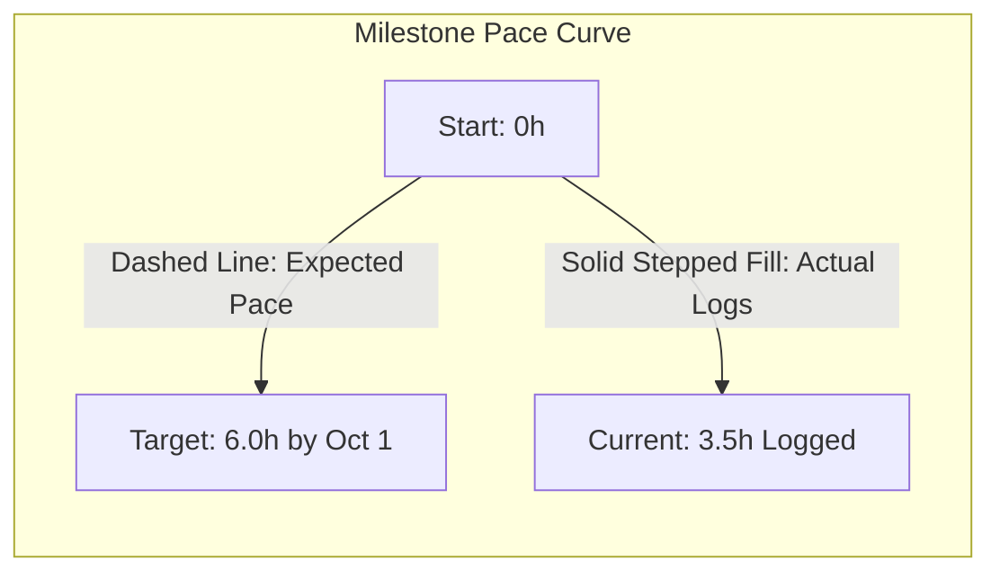

# Feature Specification: Medium-Term Goals & Pace Lines (Stage 2)

## 1. Overview and Objective
Medium-Term Goals & Pace Lines connects individual daily schedule blocks (e.g., a 45-minute piano session) directly to monthly and quarterly milestones (e.g., "Master Chopin Nocturne Op. 9 No. 2 - Page 1").

**The Core Metric:** Utilizing the **Strides-style Pace Line**, the system calculates whether the user's cumulative time investment is mathematically on pace to reach target milestone completion dates.

---

## 2. Mathematical Pace Line Engine

For any active milestone with a target date and target hour allocation:

### Expected Pace Formula
$$\text{Expected Hours}(t) = \text{Total Target Hours} \times \left( \frac{t - \text{Start Date}}{\text{Target Date} - \text{Start Date}} \right)$$

### Pace Delta & Status Evaluation
$$\Delta_{\text{pace}} = \text{Actual Logged Hours}(t) - \text{Expected Hours}(t)$$

* **`Ahead of Pace` ($\Delta > +10\%$):** User is ahead of schedule; milestone can be completed early.
* **`On Track` ($-10\% \le \Delta \le +10\%$):** Trajectory aligns with timeline.
* **`At Risk` ($-25\% \le \Delta < -10\%$):** Falling behind; requires hour reallocation in upcoming weekly plans.
* **`Stalled / Off Track` ($\Delta < -25\%$ or zero logs for >10 days):** Flags bottleneck diagnostic for weekly retrospective.

---

## 3. Visualization Interface

* **Interactive Curve:** Displays the ideal linear target pace slope against actual daily logged step increments.
* **Status Pill:** Visual indicator showing `+1.5h Ahead` (Teal) or `-2.0h Deficit` (Amber).
* **Direct Schedule Linkage:** Tapping a milestone creates or auto-populates a loosely scheduled block in today's daily schedule.
