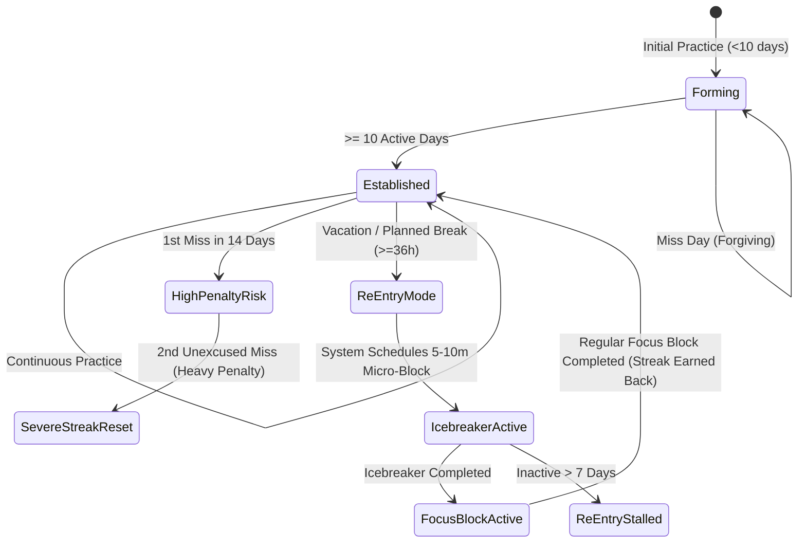

# Feature Specification: Asymmetric Momentum & Streak Engine (Stage 2)

## 1. Overview and Philosophy
Traditional productivity apps enforce fragile, binary streak systems: miss one day, and a 60-day streak resets to zero, causing demoralization and app abandonment. 

**Stage 2** implements an **Asymmetric Momentum Engine** that accurately reflects human behavioral psychology:
1. Low friction during the early formation phase.
2. High accountability and heavy miss penalties once a habit is firmly established.
3. A structured, compassionate **Re-Entry Protocol** after vacations, illnesses, or multi-day travel.

---

## 2. The Three Momentum States

### State 1: Habit Formation Phase (`< 10 days`)
* **Context:** Starting a new objective or routine (e.g., initial days of learning piano).
* **Mechanic:** Forgiving. Missed days do not wipe the counter completely; momentum is tracked as a rolling density (e.g. 6 of 8 days active) rather than a fragile binary chain.

### State 2: High-Momentum Phase (`>= 10 days`)
* **Context:** Routine is established (e.g., user has practiced piano every day except once in the last two weeks).
* **Mechanic:** **Heavy Accountability Penalty.** Future unexcused misses trigger high streak penalties, reflecting the real psychological risk of habit decay once established.

### State 3: Re-Entry Mode (Post-Vacation / Trip Protocol)
* **Context:** User returns after an intentional vacation, trip, or illness where practice was paused.
* **Mechanic (The Icebreaker Recovery):**
  1. The streak is preserved in a `re_entry` protected state.
  2. The system prompts a low-friction **5–10 minute "Icebreaker" block** in the daily schedule (e.g., *"Play through Chopin measures 1–4 once"*).
  3. Completing the icebreaker unlocks a standard full focus block later that day.
  4. Completing both re-engages the streak and restores the goal to active high-momentum status.

---

## 3. Ingestion & Analytics Linkage

The Momentum Engine continuously evaluates the ingested daily reports from `data-storage-and-ingestion`:
* Scans `scheduleItems` for completed blocks matching `objectiveId`.
* Calculates 14-day rolling activity density ($D_{14} = \text{Active Days} / 14$).
* Triggers re-entry badges and prompts when the time delta since the last active log exceeds 36 hours.
