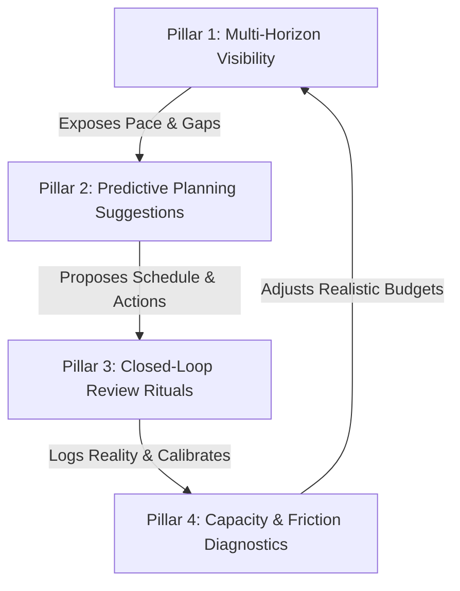

# Product Narrative: Personal Productivity Engine

### What is the problem?
Most personal productivity software falls into one of two traps:
1. **The Blank-Slate Trap (Notion, Obsidian):** Infinite flexibility demands continuous database maintenance, resulting in "productivity procrastination" and setup fatigue.
2. **The Micro-Task Disconnect (Todoist, Apple Reminders):** Daily checklists exist in total isolation from long-term aspirations. You can check off 25 tasks a day and feel productive while your actual 1-year and 3-year objectives remain completely starved.

Furthermore, traditional goal trackers enforce rigid, guilt-driven streak mechanics. If you break a streak after returning from vacation or illness, you are greeted with a demoralizing zero-score, leading directly to dashboard abandonment. Conversely, they fail to enforce meaningful accountability once a habit has genuinely formed.

### Who has the problem?
Ambitious individual knowledge workers, creators, and engineers who manage multifaceted commitments (craft, career, health, personal projects) and need an **opinionated, single-user system** that guarantees daily actions ladder directly into long-term goals without requiring them to build or maintain a complex project management system.

### How do people currently solve this problem, and how do those solutions fall down?
* **Generic Task Managers:** Optimize for volume of completed checkboxes rather than objective impact or time allocation.
* **Complex OKR Tools:** Built for enterprise teams; impose heavy overhead and fail to connect to daily calendar and capacity constraints.
* **Habit Trackers:** Binary (Done / Not Done) without nuance. They treat day 1 after vacation identically to day 45 of an established routine, failing to model real human momentum.

### What has changed enabling a new solution?
* **Capacity-Aware Time Budgeting:** Recognizing that personal time is a strictly finite weekly capacity (e.g., 20–30 discretionary deep-work hours).
* **Asymmetric Momentum Physics:** Differentiating between the **formation phase** (<10 days), the **high-momentum phase** (>10 days with heavy miss penalties), and the **re-entry phase** (post-vacation/break "icebreaker" ramping).
* **Cross-Platform Expo SDK 57 Universal Client:** Delivering a zero-friction, tactile experience across desktop web and mobile with instant offline access and sub-second interaction speed.

---

## The Four Core Product Pillars

The system is structured around four interlocking pillars designed for a single user:

### Pillar 1: Multi-Horizon Objective Visibility
* **Short-Term (Day / Week):** Input hours logged, daily focus velocity, active streaks.
* **Medium-Term (Month / Quarter):** Milestone progress and **Strides-style Pace Lines** indicating whether the user is mathematically ahead or behind schedule.
* **Long-Term (Year / Multi-Year):** North Star objectives distributed across core life domains (Craft, Health, Career, Wealth).
* **Dual Lenses:**
  - *Per-Goal Lens:* Deep dive into an objective's time investment, milestone trajectory, and streak momentum.
  - *Macro Productivity Index (PI):* An aggregate 0–100 health score reflecting holistic execution consistency across all horizons.

### Pillar 2: Predictive Planning Suggestions
* **Deterministic Rules Engine:** Heuristically analyzes horizon pace, deadline proximity, and capacity deficits to suggest the next highest-leverage actions.
* **Short-Term:** Generates the "High-Impact Focus Blocks" for today, fitting within the day's remaining capacity budget.
* **Medium-Term:** Identifies milestone deadline bunching and recommends milestone date smoothing.
* **Long-Term:** Identifies starved life domains (e.g., "0 hours logged toward Piano in 12 days") and recommends schedule rebalancing.

### Pillar 3: Closed-Loop Cadence Rituals (Daily Logging & User-as-Coach)
* **Daily Execution Logging:** Users log what actually got done each day (hours spent, milestones advanced). This log **immediately burns down scheduled capacity** and updates historical capacity metrics.
* **Morning Calibration (2 mins):** Confirms today's focus blocks against actual available energy and hours.
* **Weekly Retrospective (User as Coach):** The user steps into the coach role once a week. The system prepares the data (hours logged vs. planned, pace deltas, starved goals, streak milestones), and the user conducts an honest strategic assessment to set next week's horizon commitments.

### Pillar 4: Capacity & Friction Diagnostics
* **Reality-Based Capacity Modeling:** Treats weekly hours as a fixed resource container. Scheduled work cannot exceed physical capacity.
* **Stall & Bottleneck Detection:** Alerts user when an objective has zero logs for >10 days.
* **Asymmetric Momentum & Re-Entry Mechanics:**
  - *Habit Formation (<10 days):* Forgiving ramp-up.
  - *High Momentum (>10 days):* Strict accountability with heavy streak penalties for unexcused misses.
  - *Re-Entry Mode (Post-Break/Vacation):* Instead of a punishing streak reset, the system schedules a low-friction **"Icebreaker Micro-Block"** (5–10 mins) to break inertia, followed by a standard focus block later to regain momentum and earn back the streak.

---

## How Do You Know It's Better?

* **Quantitative:**
  - 100% of weekly planned hours bounded by measured physical capacity (zero phantom commitments).
  - <2 minutes required for daily logging and calibration.
  - >80% preservation of habits post-vacation via the re-entry icebreaker mechanic.
* **Qualitative:**
  - Eliminates the guilt of broken streaks while establishing deep intrinsic accountability.
  - Provides total clarity that daily minutes are actively serving multi-year life goals.
