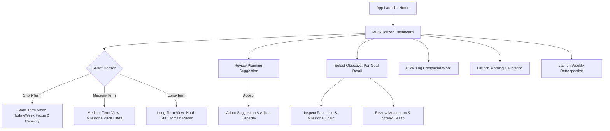
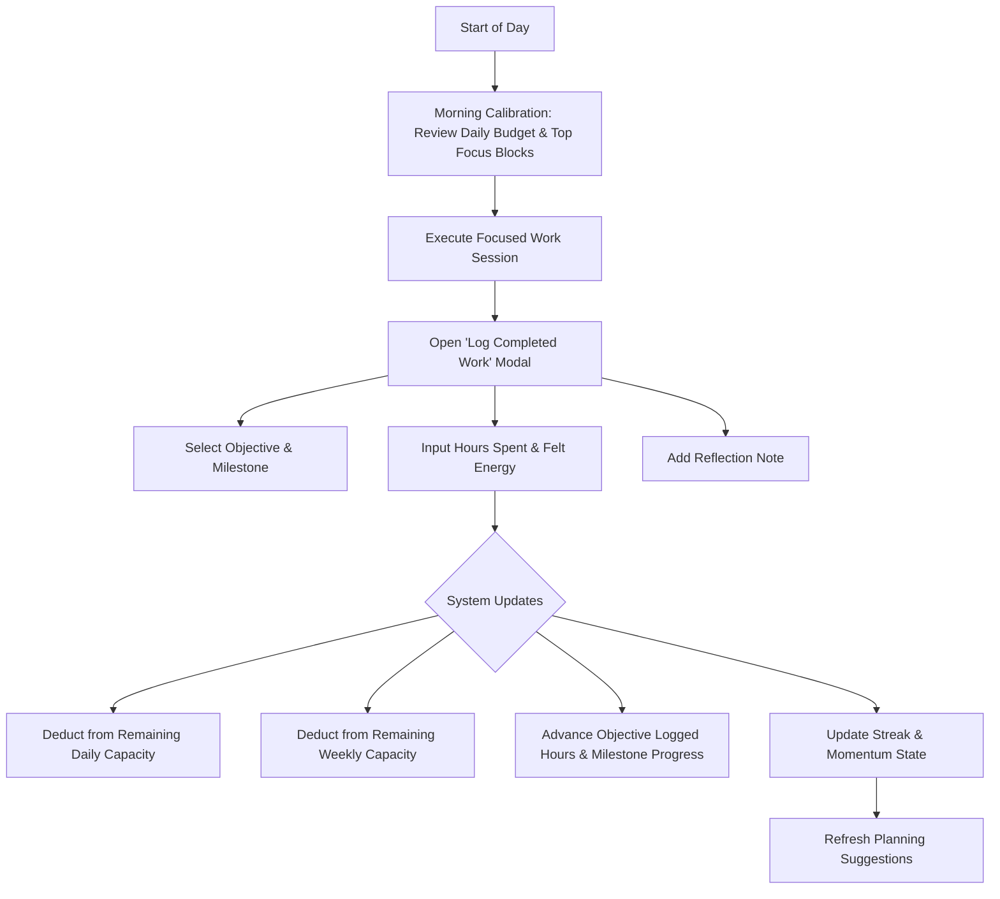
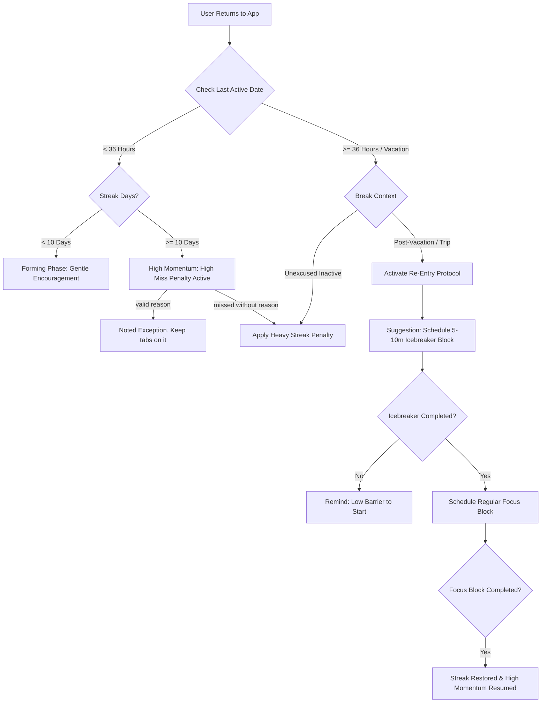
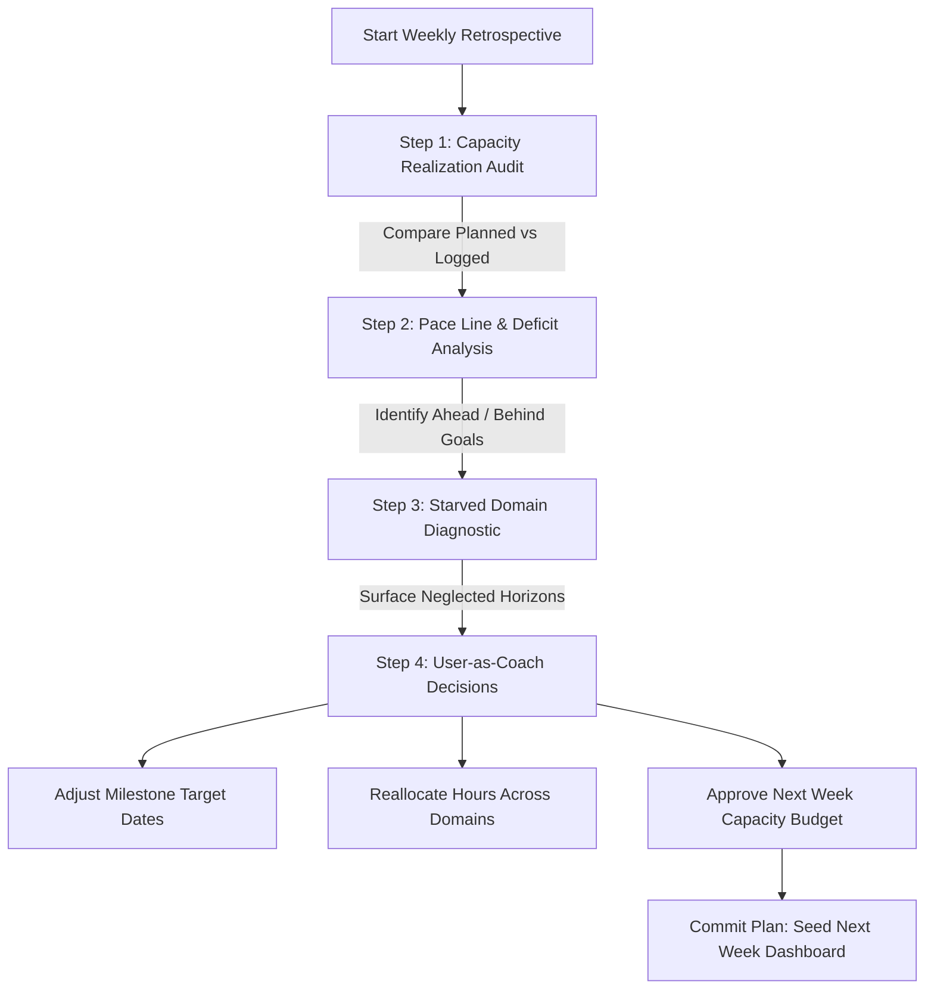

# User Flow & Ritual Cadence Specification

**Document Purpose:** Maps user interaction flows, multi-horizon navigation, daily capacity logging, re-entry momentum mechanics, and the weekly retrospective ritual.

---

## 1. High-Level Navigation & System Flow

---

## 2. Daily Cadence: Execution Logging & Capacity Burndown

The daily flow bridges planned intentionality with actual execution, immediately burning down the user's capacity budget:

### Step-by-Step UX Breakdown: Daily Logging
1. **Trigger:** User taps `+ Log Completed Work` on the dashboard or goal detail view.
2. **Input Fields:**
   - **Objective / Milestone Dropdown:** Pre-selected if initiated from goal screen.
   - **Hours Actually Spent:** Step input (e.g., 0.5h, 1.0h, 1.5h).
   - **Felt Energy:** 3-tap segmented control (`High`, `Medium`, `Low`).
   - **Reflection Note:** Optional one-sentence reflection.
3. **Immediate System Feedback:**
   - Visual gauge animates: `Remaining Today: 3.5h -> 2.0h`.
   - Goal progress bar advances.
   - Streak counter glows with confirmation indicator.

---

## 3. Momentum & Re-Entry Protocol Flow

Models human habits with asymmetric rigor: rewarding established consistency while smoothing post-break re-entry:

### Step-by-Step UX Breakdown: Post-Vacation Re-Entry
1. **Detection:** User returns after a multi-day trip. Instead of a zero-out warning, the dashboard highlights a **Re-Entry Alert**:
   > *"Welcome back! Let's get momentum moving without friction. We've preserved your streak in Re-Entry Mode."*
2. **Icebreaker Suggestion:** The engine proposes a 10-minute micro-session (e.g., *"Play through Chopin measures 1–4 once"*).
3. **Execution & Earn-Back:** Upon logging the icebreaker, the system offers a standard focus block later that afternoon. Completing both marks the streak as **Restored**, avoiding demotivating resets while preserving integrity.

---

## 4. Weekly Retrospective: User as Coach Flow

Once a week (e.g., Sunday evening or Monday morning), the user steps into the coach role:

### Step-by-Step UX Breakdown: Weekly Retrospective
1. **Step 1 (Capacity Audit):** System displays a clean visual breakdown of the week's 25-hour budget: `21.5h Logged (86% Realized)`. Highlights whether user overburned or underutilized.
2. **Step 2 (Pace Line Analysis):** Renders progress curves for active milestones. Shows which objectives advanced ahead of target and which accumulated a pace deficit.
3. **Step 3 (Starved Domain Diagnostic):** Flags any life domain that received 0 hours of focus during the week (e.g. Health).
4. **Step 4 (Coach's Strategic Commitments):** The user writes 1–2 coaching notes for themselves and sets the hour allocations for next week's horizon commitments before finalizing.
