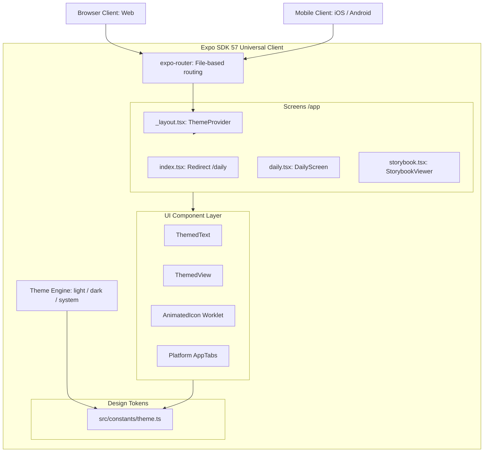

# Technical Architecture Overview

## High-Level System Architecture

Personal Dashboard is an offline-capable, cross-platform client application engineered with React 19, React Native 0.86, and Expo SDK 57.



---

## Technical Documentation Folder Structure

To preserve the Docs-as-Specification paradigm across development iterations, the repository maintains this standard structure:

```
docs/
├── product/                          # Product intent, PRD, design tokens, flows
│   ├── design-system.md              # Token dictionary and primitive component rules
│   ├── product-narrative.md          # Core problem, audience, and value proposition
│   ├── product-specification.md      # Features, wireframes, KPIs
│   └── user-flow.md                  # State machines and navigation diagrams
├── technical-documentation/          # System architecture and runtime contracts
│   ├── architecture-overview.md      # High-level architecture and platform strategy
│   └── services/
│       └── expo-app-service.md       # Expo router, tabs, and component contracts
├── features/                         # Granular feature specifications
│   └── color-picker.md               # Swatch palette, search, and clipboard spec
├── operations/                       # Build, run, and release SOPs
│   └── development-workflow.md       # Local development, testing, and EAS builds
└── infrastructure/                   # Environment requirements and tooling
    └── environment-setup.md          # Node, Yarn, Expo version pinning
```

---

## Platform Strategy: Universal Divergence

To achieve high platform fidelity without compromising universal compatibility, the codebase follows the Expo platform-extension pattern:

| Concern | Web Implementation | Native (iOS / Android) Implementation |
| :--- | :--- | :--- |
| **Tab Navigation** | `@expo-router/ui` (Top floating pill) in `app-tabs.web.tsx` | `expo-router/unstable-native-tabs` in `app-tabs.tsx` |
| **Color Scheme Hydration** | SSR-safe hook (`use-color-scheme.web.ts`) defaulting to light until mounted | Native OS scheme hook (`useColorScheme` from `react-native`) |
| **Splash Screen Overlay** | No-op / instantaneous mount | `AnimatedSplashOverlay` via `react-native-worklets` |
| **Icons & Symbols** | Vector SVG / CSS modules | SF Symbols (`expo-symbols`) / PNG densities |
