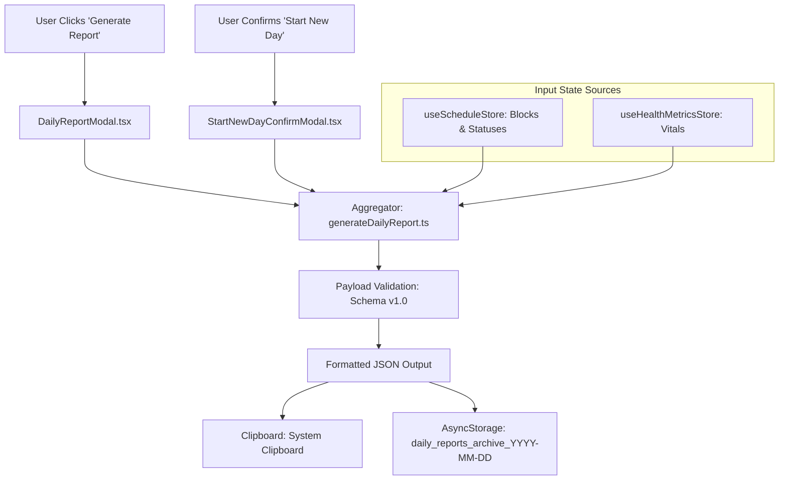

# Technical Specification: Daily Report Service & Exporter (Stage 1)

## 1. System Overview & Architectural Role

The **Daily Report Service** is the data synthesis and export pipeline of Stage 1. It pulls live states from `useScheduleStore` and `useHealthMetricsStore`, calculates completion analytics, serializes a standardized JSON payload (Schema v1.0), and provides one-tap clipboard copying alongside local client archiving.



---

## 2. Component Architecture & Responsibilities

```
src/components/daily/
├── DailyPastReportsScreen.tsx        # Screen tab for browsing and inspecting past reports
├── DailyReportModal.tsx              # Overlay modal rendering report summary & payload
├── JsonSyntaxViewer.tsx              # Monospace code block displaying indented JSON
└── CopyReportButton.tsx              # Tactile button dispatching clipboard write + toast
```

### Component Breakdown

1. **`DailyPastReportsScreen`:**
   - Mounted when the active sub-tab is `'reports'`.
   - Fetches and displays list of past report dates in descending chronological order (`getArchivedReportDates`).
   - Renders interactive date chips, summary statistics grid, and Schema v1.0 JSON payload viewer with one-tap copy and delete actions.
2. **`DailyReportModal`:**
   - Triggered from header button in `DailyScreen`.
   - Invokes `generateDailyReport(date)` on mount.
   - Displays executive summary cards (completion rate, focus hours logged, habits checked, vitals status).
   - Renders `JsonSyntaxViewer` inside a scrollable container.
3. **`JsonSyntaxViewer`:**
   - Displays the serialized JSON string with tokenized monospace typography (`Fonts.mono`).
   - Supports text selection and line-wrapping.
4. **`CopyReportButton`:**
   - Invokes `copyReportToClipboard(payload)`.
   - Temporarily updates button label and icon (`[ ✓ Copied! ]`) for 2000ms.

---

## 3. Aggregation Engine (`generateDailyReport.ts`)

```typescript
import { ScheduleBlock } from '@/types/schedule';
import { DailyHealthMetrics } from '@/types/health';
import { DailyReportPayload } from '@/types/report';

export function generateDailyReport(
  date: string,
  blocks: ScheduleBlock[],
  healthMetrics: DailyHealthMetrics
): DailyReportPayload {
  // 1. Separate duration blocks from zero-duration habits
  const durationBlocks = blocks.filter((b) => b.type !== 'zero_duration');
  const zeroDurationItems = blocks.filter((b) => b.type === 'zero_duration');

  // 2. Compute duration minutes
  const totalScheduledMinutes = durationBlocks.reduce((acc, b) => acc + b.durationMinutes, 0);
  const completedMinutes = durationBlocks
    .filter((b) => b.status === 'completed')
    .reduce((acc, b) => acc + b.durationMinutes, 0);

  const completionRate = totalScheduledMinutes > 0 
    ? Math.round((completedMinutes / totalScheduledMinutes) * 100) / 100 
    : 0;

  // 3. Compute zero-duration completion stats
  const zeroDurationItemsTotal = zeroDurationItems.length;
  const zeroDurationItemsCompleted = zeroDurationItems.filter((b) => b.status === 'completed').length;

  // 4. Assemble canonical payload
  return {
    reportVersion: '1.0',
    generatedAt: new Date().toISOString(),
    date,
    summary: {
      totalScheduledMinutes,
      completedMinutes,
      completionRate,
      zeroDurationItemsTotal,
      zeroDurationItemsCompleted,
    },
    scheduleItems: blocks.map((b) => ({
      id: b.id,
      title: b.title,
      type: b.type,
      sessionType: b.sessionType,
      startTime: b.startTime,
      durationMinutes: b.durationMinutes,
      endTime: b.endTime,
      status: b.status,
      isCompleted: b.status === 'completed',
      completedAt: b.completedAt,
      missedAt: b.missedAt,
      objectiveId: b.objectiveId,
      notes: b.notes,
    })),
    healthVitals: {
      waterIntake: { ...healthMetrics.waterIntake },
      energyLevel: healthMetrics.energyLevel,
      mood: healthMetrics.mood,
      moodNotes: healthMetrics.moodNotes,
      screenTime: { ...healthMetrics.screenTime },
    },
  };
}
```

---

## 4. Clipboard & Client Archiving Engine

```typescript
import { Storage } from '../stores/storage';
import { DailyReportPayload } from '../types';

export async function saveDailyReportSnapshot(payload: DailyReportPayload): Promise<boolean> {
  try {
    const jsonString = JSON.stringify(payload, null, 2);

    // 1. Save snapshot to Local Client Storage
    const archiveKey = `daily_reports_archive_${payload.date}`;
    await Storage.setItem(archiveKey, jsonString);

    // 2. Update master index of archived report dates
    const indexRaw = await Storage.getItem('archived_report_dates');
    const dates: string[] = indexRaw ? JSON.parse(indexRaw) : [];
    if (!dates.includes(payload.date)) {
      dates.push(payload.date);
      await Storage.setItem('archived_report_dates', JSON.stringify(dates));
    }

    return true;
  } catch (error) {
    console.error('Failed to save daily report snapshot:', error);
    return false;
  }
}

export async function getArchivedReportDates(): Promise<string[]> {
  try {
    const indexRaw = await Storage.getItem('archived_report_dates');
    return indexRaw ? JSON.parse(indexRaw) : [];
  } catch {
    return [];
  }
}

export async function getArchivedDailyReport(date: string): Promise<DailyReportPayload | null> {
  try {
    const raw = await Storage.getItem(`daily_reports_archive_${date}`);
    return raw ? JSON.parse(raw) : null;
  } catch {
    return null;
  }
}

export async function exportDailyReport(payload: DailyReportPayload): Promise<boolean> {
  try {
    const jsonString = JSON.stringify(payload, null, 2);

    // 1. Copy to System Clipboard
    await copyTextToClipboard(jsonString);

    // 2. Save snapshot to Local Client Storage
    await saveDailyReportSnapshot(payload);

    return true;
  } catch (error) {
    console.error('Failed to export daily report:', error);
    return false;
  }
}
```

---

## 5. TypeScript Data Contracts (`src/types/report.ts`)

```typescript
import { ScheduleBlock } from './schedule';
import { DailyHealthMetrics } from './health';

export interface DailyReportSummary {
  totalScheduledMinutes: number;
  completedMinutes: number;
  completionRate: number; // 0.00 to 1.00
  zeroDurationItemsTotal: number;
  zeroDurationItemsCompleted: number;
}

export interface DailyReportPayload {
  reportVersion: '1.0';
  generatedAt: string; // ISO 8601
  date: string;        // "YYYY-MM-DD"
  summary: DailyReportSummary;
  scheduleItems: ScheduleBlock[];
  healthVitals: DailyHealthMetrics;
}
```

---

## 6. Engineering Action Items

1. **Type Definitions (`src/types/report.ts`):** Codify `DailyReportPayload` and `DailyReportSummary`.
2. **Aggregation Function (`generateDailyReport.ts`):** Pure function testable with unit tests for math accuracy.
3. **Clipboard Helper (`exportDailyReport.ts`):** Safe wrapper around `expo-clipboard` with local index tracking.
4. **Modal Component (`DailyReportModal.tsx`):** Integration with `ThemedView`, formatted JSON code block, and copy confirmation toast.
