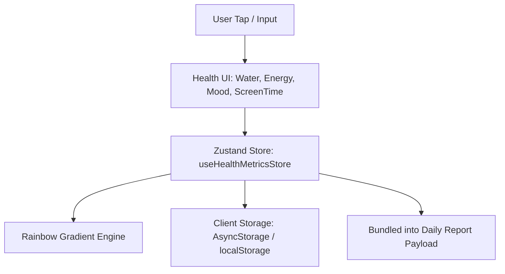

# Technical Specification: Health Metrics Service (Stage 1)

## 1. System Overview & Architectural Role

The **Health Metrics Service** governs the non-time-specific daily inputs (hydration, energy, mood, screen time). It operates alongside the schedule checklist, maintaining a synchronized daily vitals state that persists locally and feeds into the daily report generator.



---

## 2. Component Architecture & Hierarchy

```
src/components/health/
├── DailyHealthScreen.tsx             # Parent view container for all daily vitals
├── DailySubTabs.tsx                  # Top sub-navigation bar (Schedule vs Vitals)
├── WaterGradientBar.tsx              # Rainbow spectrum hydration gradient visualizer
├── EnergyLevelSelector.tsx           # Segmented 3-point capacitive rating pills
├── MoodRatingCard.tsx                # 5-choice mood selector with qualitative text input
└── ScreenTimeInput.tsx               # Numerical hour & minute steppers with categorization
```

### Component Breakdown

1. **`DailyHealthScreen`:**
   - Mounts under the `Daily` route when the active sub-tab is set to `'vitals'`.
   - Organizes metrics vertically using tokenized padding (`Spacing.four`).
2. **`DailySubTabs`:**
   - Floating pill toggle using `ThemedView` and `ThemedText`.
   - Dispatches tab switch between `'schedule'` and `'vitals'`.
3. **`WaterGradientBar`:**
   - Displays volume count (`2,250 ml of 3000 ml`) and percentage only (`75%`) in top-right without mention of glasses.
   - Flanked directly on the left and right by minimal circular `−` and `+` icon buttons.
   - Renders axis labels at `0`, `1500ml`, and `3000ml` beneath the track.
   - Renders a multi-stop horizontal gradient bar filling dynamically up to 3000ml.
4. **`EnergyLevelSelector`:**
   - Segmented radio pills ordered left-to-right from depleted to energized: `🔋 Low` (`#F97316`) $\to$ `⚖️ Medium` (`#EAB308`) $\to$ `⚡ High` (`#10B981`).
5. **`MoodRatingCard`:**
   - 5-item horizontal selector arranged left-to-right from lowest to highest: `😣 Stressed` $\to$ `😔 Low` $\to$ `😐 Neutral` $\to$ `🙂 Good` $\to$ `😄 Great`.
   - Text input for optional qualitative notes with auto-save.
6. **`ScreenTimeInput`:**
   - Form inputs for total screen time and optional deep work / leisure splits.

---

## 3. Rainbow Spectrum Gradient Engine

The water intake fill bar utilizes a dynamic linear gradient reflecting hydration state across 6 distinct color stops scaled to 3000ml (12 increments of 250ml):

$$\text{Red } (\#EF4444) \longrightarrow \text{Orange } (\#F97316) \longrightarrow \text{Yellow } (\#EAB308) \longrightarrow \text{White } (\#FFFFFF) \longrightarrow \text{Sky Blue } (\#38BDF8) \longrightarrow \text{Deep Indigo } (\#4F46E5)$$

### Mathematical Color Stop Definition

The full gradient spans the domain $[0, 100\%]$ representing 0 to 3000ml. The fill level is controlled via an underlying continuous gradient layer with an overlay opacity filter overtop.

```typescript
export const WATER_GRADIENT_STOPS = [
  { offset: '0%', color: '#EF4444' },   // Red (0-750ml / Dehydrated)
  { offset: '20%', color: '#F97316' },  // Orange (750-1250ml)
  { offset: '40%', color: '#EAB308' },  // Yellow (1250-1750ml)
  { offset: '60%', color: '#FFFFFF' },  // White baseline (1750-2250ml)
  { offset: '80%', color: '#38BDF8' },  // Sky Blue (2250-2750ml)
  { offset: '100%', color: '#4F46E5' }, // Deep Indigo (3000ml / Optimal)
] as const;

export const WATER_GRADIENT_CSS =
  'linear-gradient(90deg, #EF4444 0%, #F97316 20%, #EAB308 40%, #FFFFFF 60%, #38BDF8 80%, #4F46E5 100%)';
```

### Layered Architecture (Underlying Gradient + Opacity Filter)

Instead of squeezing the gradient into an expanding bar or drawing clipped geometry, `WaterGradientBar` utilizes a 2-layer composite:
1. **Underlying Gradient Layer:** Spans 100% width and height of the track, rendering the canonical rainbow spectrum continuously from 0 to 3000ml (`experimental_backgroundImage` in React Native / `background` CSS in Web).
2. **Opacity Filter Layer Overtop:** Positioned absolutely from `left: ${percentDisplay}%` to `right: 0` with `backgroundColor: '#1c1d21'` and `opacity: 0.85`.
   - Reached intake ($0$ to $P\%$) has no overlay and shines at 100% full vibrance.
   - Unreached capacity ($P\%$ to $100\%$) is filtered by the dark overlay, preserving subtle visibility of upcoming milestones while indicating inactive status.

---

## 4. State Management Contract (`useHealthMetricsStore.ts`)

```typescript
import { create } from 'zustand';
import AsyncStorage from '@react-native-async-storage/async-storage';
import { DailyHealthMetrics, EnergyLevel, MoodRating } from '@/types/health';

interface HealthMetricsStoreState {
  selectedDate: string;
  metrics: DailyHealthMetrics;
  isLoading: boolean;

  // Actions
  setDate: (date: string) => Promise<void>;
  addWaterGlass: () => Promise<void>;
  removeWaterGlass: () => Promise<void>;
  setEnergyLevel: (level: EnergyLevel) => Promise<void>;
  setMood: (mood: MoodRating, notes?: string) => Promise<void>;
  setScreenTime: (totalMinutes: number, productiveMinutes?: number, leisureMinutes?: number) => Promise<void>;
  resetMetrics: () => Promise<void>;
  startNewDayMetrics: (nextDate: string) => Promise<void>;
  loadCachedMetrics: (date: string) => Promise<void>;
}

const DEFAULT_METRICS: DailyHealthMetrics = {
  date: '',
  waterIntake: { glasses: 0, targetGlasses: 8, milliliters: 0, percentageOfTarget: 0 },
  energyLevel: 'medium',
  mood: 'good',
  screenTime: { totalMinutes: 0 },
  lastUpdated: new Date().toISOString(),
};

export const useHealthMetricsStore = create<HealthMetricsStoreState>((set, get) => ({
  selectedDate: new Date().toISOString().split('T')[0],
  metrics: { ...DEFAULT_METRICS, date: new Date().toISOString().split('T')[0] },
  isLoading: false,

  setDate: async (date) => {
    set({ selectedDate: date });
    await get().loadCachedMetrics(date);
  },

  addWaterGlass: async () => {
    const current = get().metrics.waterIntake.glasses;
    const target = get().metrics.waterIntake.targetGlasses;
    const next = current + 1;
    
    const updatedMetrics: DailyHealthMetrics = {
      ...get().metrics,
      waterIntake: {
        glasses: next,
        targetGlasses: target,
        milliliters: next * 250,
        percentageOfTarget: next / target,
      },
      lastUpdated: new Date().toISOString(),
    };

    set({ metrics: updatedMetrics });
    await AsyncStorage.setItem(
      `health_metrics_cache_${get().selectedDate}`,
      JSON.stringify(updatedMetrics)
    );
  },

  setEnergyLevel: async (level) => {
    const updated = { ...get().metrics, energyLevel: level, lastUpdated: new Date().toISOString() };
    set({ metrics: updated });
    await AsyncStorage.setItem(`health_metrics_cache_${get().selectedDate}`, JSON.stringify(updated));
  },

  loadCachedMetrics: async (date) => {
    set({ isLoading: true });
    try {
      const raw = await AsyncStorage.getItem(`health_metrics_cache_${date}`);
      if (raw) {
        set({ metrics: JSON.parse(raw) });
      } else {
        set({ metrics: { ...DEFAULT_METRICS, date } });
      }
    } finally {
      set({ isLoading: false });
    }
  },
}));
```

---

## 5. Cross-Platform Considerations

* **Hydration Safety on Web:** `AsyncStorage` falls back to `localStorage` on web via the standard Expo polyfill. `loadCachedMetrics` executes inside `useEffect` on component mount to prevent server/client markup mismatches.
* **SVG Gradient Defs:** Unique SVG `id="waterRainbowGradient"` ensures that multiple gradient instances or re-renders do not conflict in the DOM.
