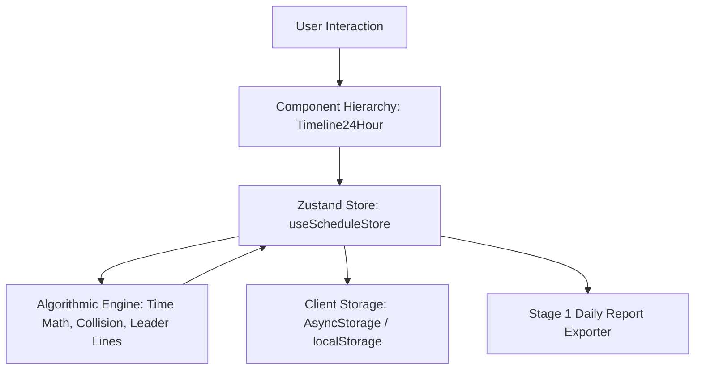

# Technical Specification: Schedule & Checklist Service (Stage 1)

## 1. System Overview & Architectural Role

The **Schedule & Checklist Service** powers the primary execution surface of Stage 1. It is an offline-first, client-rendered 24-hour vertical timeline combining duration-based schedule blocks with instant zero-duration habit checkpoints.



---

## 2. Component Architecture & Responsibilities

```
src/components/schedule/
├── DailyScheduleScreen.tsx           # Main screen container & view orchestration
├── Timeline24Hour.tsx                 # 24-hour vertical scroll container & hourly grid lines
├── LeftLaneDurationBlock.tsx          # Strictly & Loosely scheduled duration blocks (50% width)
├── RightLaneZeroDurationBlock.tsx     # Zero-duration habit checkpoint card (50% width)
├── LeaderLineSvg.tsx                  # SVG connecting path for displaced zero-duration items
├── TriStateCheckbox.tsx               # Circular tri-state checkbox primitive
├── AddScheduleItemFab.tsx             # Floating Action Button (+ FAB) for creating items
├── BlockConfigModal.tsx               # Reactive block creation & time recalculation sheet
├── ResetConfirmModal.tsx              # Confirmation modal for resetting today's tasks & vitals
└── StartNewDayConfirmModal.tsx        # Rollover modal archiving summary JSON & advancing day
```

### Component Breakdown

1. **`DailyScheduleScreen` & `DailyScreen`:**
   - Mounts top navigation sub-tabs (`Schedule & Plan` vs `Daily Health & Vitals`).
   - Hosts header actions:
     - `[ 📊 Generate Report ]`: Launches synthesis modal and JSON exporter.
     - `[ ↺ Reset ]`: Opens `ResetConfirmModal` to clear task progress.
     - `[ 🌅 Start New Day ]`: Opens `StartNewDayConfirmModal`, archives today's summary JSON into storage, and rolls over to tomorrow.
   - Subscribes to `useScheduleStore` and passes normalized block collections to `Timeline24Hour`.
   - Mounts `AddScheduleItemFab` anchored to the bottom-right.

2. **`Timeline24Hour`:**
   - Provides a continuous vertical scroll view mapped to a fixed scale of $H_{\text{hour}} = 64\text{px}$ per hour (total timeline height: $24 \times 64\text{px} = 1536\text{px}$).
   - Renders the central/left time ruler with 24 hourly ticks (`00:00` to `23:00`).
   - Splits screen real estate horizontally into two absolute/flex coordinate lanes:
     - **Left Lane ($0\% \to 50\%$ width):** Renders `LeftLaneDurationBlock` elements.
     - **Right Lane ($50\% \to 100\%$ width):** Renders `RightLaneZeroDurationBlock` elements alongside `LeaderLineSvg` overlays.

3. **`LeftLaneDurationBlock`:**
   - Computes absolute top position and container height:
     $$y_{\text{top}} = \left( \frac{\text{startMinutes}}{60} \right) \times 64\text{px}$$
     $$\text{height} = \max\left( \left( \frac{\text{durationMinutes}}{60} \right) \times 64\text{px}, 36\text{px} \right)$$
   - Pins card header to the top edge: renders `TriStateCheckbox`, item title, session category badge, and time readout (`13:30 - 14:15`).
   - Press handler triggers `BlockConfigModal` with block payload.

4. **`RightLaneZeroDurationBlock`:**
   - Renders zero-duration habit checkpoints (`durationMinutes === 0`).
   - Receives calculated `renderedY` from the collision detection engine.
   - Houses `TriStateCheckbox` and task label.

5. **`LeaderLineSvg`:**
   - Absolute SVG overlay rendered when $y_{\text{rendered}} \neq y_{\text{anchor}}$.
   - Draws an angled stroke connecting the time tick $(x_0, y_{\text{anchor}})$ to the card anchor $(x_1, y_{\text{rendered}} + \text{height}/2)$.

6. **`TriStateCheckbox`:**
   - Stateless primitive cycling through `pending` $\to$ `completed` $\to$ `missed` $\to$ `pending`.
   - Renders animated SVG icons:
     - `pending`: `○` (empty border ring).
     - `completed`: `🟢 ✓` (emerald green fill with checkmark).
     - `missed`: `🔴 ✗` (coral red fill with X mark).

7. **`AddScheduleItemFab`:**
   - Circular elevated button ($56\times56\text{px}$) with a `+` icon positioned at `position: 'absolute'`, `bottom: 24`, `right: 24`, with high elevation/shadow (`elevation: 6`, `shadowOpacity: 0.3`).
   - Press handler dispatches creation mode in `BlockConfigModal` pre-populated with the next 15-minute time increment and a 30-minute duration default.

---

## 3. Mathematical & Algorithmic Engines

### 1. Bidirectional Time Editor Calculation Engine
When the user edits start time, duration, or end time in `BlockConfigModal`, the calculation utility enforces strict consistency:

```typescript
export function recalculateTime(
  changedField: 'startTime' | 'duration' | 'endTime',
  current: { startTime: string; durationMinutes: number; endTime: string }
): { startTime: string; durationMinutes: number; endTime: string } {
  const startMin = timeStringToMinutes(current.startTime);
  
  if (changedField === 'startTime' || changedField === 'duration') {
    // End time updates based on duration
    const newEndMin = (startMin + current.durationMinutes) % 1440;
    return {
      startTime: current.startTime,
      durationMinutes: current.durationMinutes,
      endTime: minutesToTimeString(newEndMin),
    };
  } else {
    // End time was edited -> recalculate duration
    const endMin = timeStringToMinutes(current.endTime);
    let diff = endMin - startMin;
    if (diff < 0) diff += 1440; // overnight wrap
    return {
      startTime: current.startTime,
      durationMinutes: diff,
      endTime: current.endTime,
    };
  }
}
```

### 2. Right-Lane Collision Avoidance & Downward Stacking
When multiple zero-duration items occur at the same timestamp or within minimum vertical card spacing ($H_{\text{card}} = 32\text{px}$ + $8\text{px}$ margin = $40\text{px}$):

```typescript
export interface PositionedZeroDurationItem {
  block: ScheduleBlock;
  anchorY: number;      // Exact coordinate on 24h timeline (px)
  renderedY: number;    // Adjusted coordinate after collision resolution (px)
  isDisplaced: boolean; // renderedY > anchorY
}

export function layoutZeroDurationItems(
  items: ScheduleBlock[],
  hourHeight: number = 64,
  cardHeight: number = 40
): PositionedZeroDurationItem[] {
  // Sort items chronologically by startTime
  const sorted = [...items].sort((a, b) => 
    timeStringToMinutes(a.startTime) - timeStringToMinutes(b.startTime)
  );

  let lastOccupiedBottom = -Infinity;
  const result: PositionedZeroDurationItem[] = [];

  for (const block of sorted) {
    const startMin = timeStringToMinutes(block.startTime);
    const anchorY = (startMin / 60) * hourHeight;
    
    // Position at anchorY or push down to lastOccupiedBottom
    const renderedY = Math.max(anchorY, lastOccupiedBottom);
    lastOccupiedBottom = renderedY + cardHeight;

    result.push({
      block,
      anchorY,
      renderedY,
      isDisplaced: Math.abs(renderedY - anchorY) > 2,
    });
  }

  return result;
}
```

### 3. SVG Leader Line Coordinate Computation
When an item is displaced (`isDisplaced === true`):
$$\mathbf{P}_0 = (x_0, y_{\text{anchor}}), \quad \mathbf{P}_1 = (x_1, y_{\text{rendered}} + 16)$$
A cubic bezier or 2-segment polyline is constructed:
$$M(x_0, y_{\text{anchor}}) \to L(x_0 + 12, y_{\text{anchor}}) \to L(x_1 - 8, y_{\text{rendered}} + 16) \to L(x_1, y_{\text{rendered}} + 16)$$
Styled with `stroke="#94A3B8" strokeWidth="1.5" strokeDasharray="3,3"`.

### 4. Timezone-Safe Date Rollover Engine
When rolling over to tomorrow via "Start New Day", the date arithmetic utilizes UTC-normalized components to avoid daylight saving or local timezone shifts:

```typescript
export function getNextDayDateString(currentDateStr: string): string {
  const parts = currentDateStr.trim().split('-');
  const year = parseInt(parts[0], 10);
  const month = parseInt(parts[1], 10);
  const day = parseInt(parts[2], 10);
  const d = new Date(Date.UTC(year, month - 1, day));
  d.setUTCDate(d.getUTCDate() + 1);
  return d.toISOString().split('T')[0];
}
```

---

## 4. State Management Contract (`useScheduleStore.ts`)

```typescript
import { create } from 'zustand';
import AsyncStorage from '@react-native-async-storage/async-storage';
import { ScheduleBlock, ItemStatus } from '@/types/schedule';

interface ScheduleStoreState {
  selectedDate: string; // "YYYY-MM-DD"
  blocks: ScheduleBlock[];
  isLoading: boolean;
  
  // Actions
  setDate: (date: string) => Promise<void>;
  addBlock: (block: Omit<ScheduleBlock, 'id'>) => Promise<void>;
  updateBlock: (id: string, updates: Partial<ScheduleBlock>) => Promise<void>;
  cycleStatus: (id: string) => Promise<void>;
  deleteBlock: (id: string) => Promise<void>;
  resetSchedule: () => Promise<void>;
  startNewDaySchedule: (nextDate: string) => Promise<void>;
  loadCachedSchedule: (date: string) => Promise<void>;
}

export const useScheduleStore = create<ScheduleStoreState>((set, get) => ({
  selectedDate: new Date().toISOString().split('T')[0],
  blocks: [],
  isLoading: false,

  setDate: async (date) => {
    set({ selectedDate: date });
    await get().loadCachedSchedule(date);
  },

  cycleStatus: async (id) => {
    const nextStatusMap: Record<ItemStatus, ItemStatus> = {
      pending: 'completed',
      completed: 'missed',
      missed: 'pending',
    };

    const updated = get().blocks.map((b) => {
      if (b.id !== id) return b;
      const nextStatus = nextStatusMap[b.status];
      return {
        ...b,
        status: nextStatus,
        completedAt: nextStatus === 'completed' ? new Date().toISOString() : undefined,
        missedAt: nextStatus === 'missed' ? new Date().toISOString() : undefined,
      };
    });

    set({ blocks: updated });
    // Persist immediately to AsyncStorage
    const cacheKey = `schedule_cache_${get().selectedDate}`;
    await AsyncStorage.setItem(cacheKey, JSON.stringify(updated));
  },

  loadCachedSchedule: async (date) => {
    set({ isLoading: true });
    try {
      const cacheKey = `schedule_cache_${date}`;
      const raw = await AsyncStorage.getItem(cacheKey);
      if (raw) {
        set({ blocks: JSON.parse(raw) });
      } else {
        set({ blocks: [] });
      }
    } finally {
      set({ isLoading: false });
    }
  },

  // addBlock, updateBlock, deleteBlock follow identical mutation + cache write patterns
}));
```

---

## 5. Cross-Platform & Styling Details

* **Universal SVG:** Use `react-native-svg` (`Svg`, `Path`, `Circle`) for rendering leader lines and checkboxes. This guarantees seamless operation across iOS, Android, and Web (`react-native-svg-web`).
* **Design Token Linkage:** Card backgrounds pull from `Colors[theme].backgroundElement`, borders from `Colors[theme].backgroundSelected`, and text from `ThemedText`.
